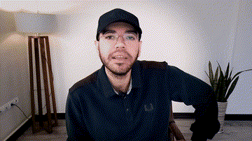

# Trading Education Channel — 29 episodes, 2020–2022

A Persian-language technical-analysis course, written and taught over **fourteen months** on YouTube. Twenty-nine episodes, written, shot, motion-graphicked, thumbnailed and edited by one person.

**This repository holds the words, not the videos.** The videos are private. The writing is the part worth keeping.

---

## Provenance

> Reconstructed in 2026 from a filesystem archive. None of this was under version control at the time.
>
> **Each episode is committed on the date it was written, recorded and cut**, recovered from the archive drive with `stat`. They run from 2020-12 to 2022-01.
>
> The text was transferred off the audio in 2026 with `whisper-large-v3-turbo` and corrected for recurring errors in trading vocabulary. That is how the words got from tape to file; the words are from the date on the commit.
>
> One limit worth stating: a modification time is not an authorship time. It records when a file was last written, which for a copied or re-saved file is later than the work. These dates are a **floor**, not independent proof.

## What is here

- **`transcripts/`** — 90 files: an `.md` per episode (timestamped, right-to-left), the same as plain `.txt`, and `.json` with per-segment timings
- **`production/`** — 149 Adobe Premiere Pro edit timelines
- **`artwork/`** — banners, cover, thumbnails, watermarks, profile picture
- **`decks/`** — the surviving slide deck, from the Fibonacci episode

**417 minutes. 273,215 characters of Persian**, roughly 55,000 words.

## The curriculum

| 1 | 2020-12-11 | ترید چیه تریدر کیه | What Is Trading, Who Is a Trader | 6 min | [`01-what-is-trading-who-is-a-trader`](transcripts/01-what-is-trading-who-is-a-trader.md) |
| 2 | 2021-01-03 | حمایت ها و مقاومت ها | Supports and Resistances | 9 min | [`02-supports-and-resistances`](transcripts/02-supports-and-resistances.md) |
| 3 | 2021-01-04 | فهم احتمال و پذیرش هیچ | Understand Probability, Accept Nothing | 8 min | [`03-understand-probability-accept-nothing`](transcripts/03-understand-probability-accept-nothing.md) |
| 4 | 2021-01-12 | تکنیکال صفر | Technical Analysis Zero | 12 min | [`04-technical-analysis-zero`](transcripts/04-technical-analysis-zero.md) |
| 5 | 2021-01-19 | تکنیکال یک | Technical Analysis One | 17 min | [`05-technical-analysis-one`](transcripts/05-technical-analysis-one.md) |
| 6 | 2021-01-26 | تکنیکال دو | Technical Analysis Two | 17 min | [`06-technical-analysis-two`](transcripts/06-technical-analysis-two.md) |
| 7 | 2021-01-30 | اسم سهمت رو سرچ نکن | Don't Search Your Stock's Name | 7 min | [`07-dont-search-your-stocks-name`](transcripts/07-dont-search-your-stocks-name.md) |
| 8 | 2021-02-16 | فیبوناچی رو قورت نده، تف کن | Don't Swallow Fibonacci - Spit It Out | 17 min | [`08-dont-swallow-fibonacci---spit-it-out`](transcripts/08-dont-swallow-fibonacci---spit-it-out.md) |
| 9 | 2021-02-23 | ایستگاه اول | First Station - review of parts 1-5 | 30 min | [`09-first-station---review-of-parts-1-5`](transcripts/09-first-station---review-of-parts-1-5.md) |
| 10 | 2021-03-02 | میخوای ضرر نکنی | So You Don't Want To Lose | 7 min | [`10-so-you-dont-want-to-lose`](transcripts/10-so-you-dont-want-to-lose.md) |
| 11 | 2021-03-10 | الگوهای کلاسیک | Classic Chart Patterns | 37 min | [`11-classic-chart-patterns`](transcripts/11-classic-chart-patterns.md) |
| 12 | 2021-03-30 | انواع معامله گر | Types of Trader | 13 min | [`12-types-of-trader`](transcripts/12-types-of-trader.md) |
| 13 | 2021-04-06 | الگوهای کندل استیک | Candlestick Patterns | 14 min | [`13-candlestick-patterns`](transcripts/13-candlestick-patterns.md) |
| 14 | 2021-04-20 | آداب برنده بودن | The Manners of Winning | 8 min | [`14-the-manners-of-winning`](transcripts/14-the-manners-of-winning.md) |
| 15 | 2021-05-11 | هارمونیک | Harmonic Patterns | 15 min | [`15-harmonic-patterns`](transcripts/15-harmonic-patterns.md) |
| 16 | 2021-05-17 | الیوت صفر | Elliott Zero | 21 min | [`16-elliott-zero`](transcripts/16-elliott-zero.md) |
| 17 | 2021-06-03 | الیوت یک | Elliott One | 27 min | [`17-elliott-one`](transcripts/17-elliott-one.md) |
| 18 | 2021-06-17 | اندیکاتور | Indicators | 28 min | [`18-indicators`](transcripts/18-indicators.md) |
| 19 | 2021-06-30 | الیوت دو | Elliott Two | 17 min | [`19-elliott-two`](transcripts/19-elliott-two.md) |
| 20 | 2021-07-29 | مدیریت سرمایه | Risk and Capital Management | 10 min | [`20-risk-and-capital-management`](transcripts/20-risk-and-capital-management.md) |
| 21 | 2021-08-28 | از کجا شروع کنیم به موج شماری | Where To Start Wave Counting | 6 min | [`21-where-to-start-wave-counting`](transcripts/21-where-to-start-wave-counting.md) |
| 21 | 2021-08-28 | از کجا شروع کنیم به موج شماری (قطعه) | Where To Start Wave Counting (fragment) | 1 min | [`21-where-to-start-wave-counting-fragment-fragment`](transcripts/21-where-to-start-wave-counting-fragment-fragment.md) |
| 22 | 2021-10-02 | چک لیست استراتژی سیستم | Trading System Strategy Checklist | 7 min | [`22-trading-system-strategy-checklist`](transcripts/22-trading-system-strategy-checklist.md) |
| 23 | 2021-10-02 | الیوت ۴ | Elliott Four | 5 min | [`23-elliott-four`](transcripts/23-elliott-four.md) |
| 24 | 2021-10-11 | ژورنال نویسی | Journaling | 10 min | [`24-journaling`](transcripts/24-journaling.md) |
| 25 | 2021-10-19 | الیوت ۵ | Elliott Five | 9 min | [`25-elliott-five`](transcripts/25-elliott-five.md) |
| 26 | 2021-11-04 | تحلیل زمانی | Time Analysis | 21 min | [`26-time-analysis`](transcripts/26-time-analysis.md) |
| 27 | 2021-11-15 | کوله پشتی قسمت آخر تکنیکال | The Backpack - Final Technical Episode | 19 min | [`27-the-backpack---final-technical-episode`](transcripts/27-the-backpack---final-technical-episode.md) |
| 28 | 2021-12-08 | پرایس اکشن ۱ | Price Action 1 | 10 min | [`28-price-action-1`](transcripts/28-price-action-1.md) |
| 29 | 2022-01-05 | price action 1 (reshoot) | Price Action 1 (reshoot) | 9 min | [`29-price-action-1-reshoot`](transcripts/29-price-action-1-reshoot.md) |

## A note on the text

Twenty-six of the twenty-nine episodes were written first and then delivered from memory, so the text reads like speech: repetitions, false starts, sentences that restart. None of that was cleaned up.

Two hundred and sixty substitutions were applied where the transcription produced a different word than the one spoken — `امواج` (waves) rendered as `انواج` 82 times, `الگو` (pattern) as `اولگو` 64 times, `تئوری` as `تهوری` 31 times, and nine smaller cases. Nothing else was edited.

## What this is not

It is not original research. The content is downstream of the standard technical-analysis literature — Elliott, Carney's harmonics, the YTC price-action series. The teaching, the sequencing and the delivery are mine; the underlying ideas are not.

## Related

- [`trading-methodology`](https://github.com/homayoun-asghari/trading-methodology) — the written system that came after this
- [`elliott-wave-reference`](https://github.com/homayoun-asghari/elliott-wave-reference) — the Elliott decks from this era
- [`motion-graphics`](https://github.com/homayoun-asghari/motion-graphics) — the After Effects sources for the intro and lower thirds
